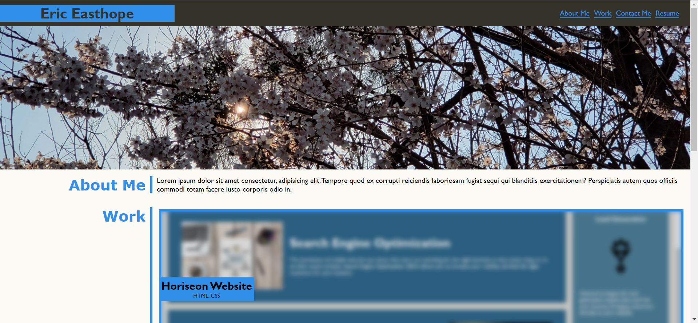
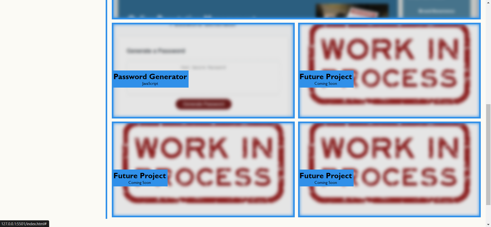
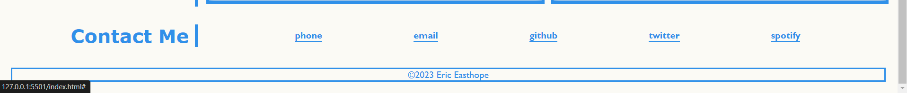

# Challenge 2 - Personal Portfolio

## Description

This website was a personal project built from scratch for showcasing various web development projects I have been able to complete. It will continue to be updated as I finish more projects that can be added.

## User Story

**AS AN** employer
**I WANT** to view a potential employee's deployed portfolio of work samples
**SO THAT** I can review samples of their work and assess whether they're a good candidate for an open position

## Acceptance Criteria

**GIVEN** I need to sample a potential employee's previous work
**WHEN** I load their portfolio
**THEN** I am presented with the developer's name, a recent photo or avatar, and links to sections about them, their work, and how to contact them
**WHEN** I click one of the links in the navigation
**THEN** the UI scrolls to the corresponding section
**WHEN** I click on the link to the section about their work
**THEN** the UI scrolls to a section with titled images of the developer's applications
**WHEN** I am presented with the developer's first application
**THEN** that application's image should be larger in size than the others
**WHEN** I click on the images of the applications
**THEN** I am taken to that deployed application
**WHEN** I resize the page or view the site on various screens and devices
**THEN** I am presented with a responsive layout that adapts to my viewport

## Challenge Directives

* Create a webpage showcasing web development projects I have created.
* Demonstrate ability to create a dynamic webpage with cohesive application of styling.
* Employ proper semantics and follow a sematic structure throughout the application.
* Incorporate dynamic elements that react to hovering and visually adjust accordingly.

## Demonstration

Website deployed at eeast.github.io/CH2-MyPortfolio/

## Credits

The webpage styling was reset using the `reset.css` file from https://github.com/elad2412/the-new-css-reset

## License

Please refer to the LICENSE in the repo.
